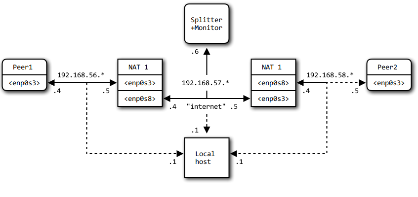

NAT traversal testing
=====================

This document shows detailed information about the test network setup used to
test NAT traversal between two P2PSP peers, each behind a NAT. General
information about the test can be found [here](NAT_test.md).

## Network setup
The setup with network interfaces and IP addresses as used in the tests is shown
in the following diagram:



## NAT types
To test the behaviour of peers behind different kinds of NAT devices (i.e.
routers), different NAT types are simulated. A short description from
[this page](https://wiki.asterisk.org/wiki/display/TOP/NAT+Traversal+Testing):

* **Full-cone NAT (FCN):**
"A full-cone NAT is one where all requests from the same internal IP address
and port are mapped to the same external IP address and port. Any external
host can send a packet to the internal host simply by sending a packet to the
mapped external address."

* **Restricted cone NAT (RCN):**
"A restricted-cone NAT is one where all requests from the same internal IP
address and port are mapped to the same external IP address and port. Unlike a
full-cone NAT though, an external host can send a packet to the internal host
only if the internal host had previously sent a packet to that external host."

* **Port-restricted cone NAT (PRCN):**
"A port-restricted cone NAT is like a restricted-cone NAT, but the restriction
also includes port numbers. An external host can send a packet to the internal
host only if the internal host had previously sent a packet to that external
host on the same port number."

* **Symmetric NAT (SYM):**
"A symmetric nat is a NAT where all requests from the same internal IP address
and port to a specific destination IP address and port are mapped to the same
external source IP address and port. If the same internal host sends a packet
with the same source address and port to a different destination, a different
mapping is used (these mappings are referred to as NAT translations). Only the
external host that receives a packet can send a packet back to the internal
host."

To test the P2PSP peer functionality, the symmetric NATs are divided again into
these subtypes, depending on the allocation of the source port of the NAT:

* **Port preservation (SYMPP):**
The public source port of the NAT is the same as the source port of the local
host. If this NAT behaviour is detected, prediction of the public port is
trivial.

* **Sequential port allocation (SYMSP):**
To allocate a new public source port, the next free port number is selected, so
the port number is incremented each time. This behaviour is covered by the P2PSP
NTS of rules in algorithms 5 and 6.

* **Random port allocation (SYMRP):**
For each new pair `(dest. address, dest. port)` a completely random public
source port is selected. A connection between two peers each behind this NAT
type cannot be established, as each other's public source port is unpredictable.

The different NAT types are configured by the following iptables rules:

### NAT 1

#### Full Cone NAT

    ```
    *filter
    :INPUT ACCEPT [0:0]
    :FORWARD ACCEPT [0:0]
    :OUTPUT ACCEPT [0:0]
    COMMIT
    *nat
    :PREROUTING ACCEPT [0:0]
    :INPUT ACCEPT [0:0]
    :OUTPUT ACCEPT [0:0]
    :POSTROUTING ACCEPT [0:0]
    -A PREROUTING -i enp0s8 -j DNAT --to-destination 192.168.56.4
    -A POSTROUTING -o enp0s8 -j SNAT --to-source 192.168.57.4
    COMMIT
    ```

#### Restricted Cone NAT

    ```
    *filter
    :INPUT ACCEPT [0:0]
    :FORWARD ACCEPT [0:0]
    :OUTPUT ACCEPT [0:0]
    -A INPUT -i enp0s3 -j ACCEPT
    -A INPUT -i enp0s8 -p tcp -m state --state RELATED,ESTABLISHED -j ACCEPT
    -A INPUT -i enp0s8 -p udp -m state --state RELATED,ESTABLISHED -j ACCEPT
    -A INPUT -i enp0s8 -p tcp -m state --state NEW -j DROP
    -A INPUT -i enp0s8 -p udp -m state --state NEW -j DROP
    COMMIT
    *nat
    :PREROUTING ACCEPT [0:0]
    :INPUT ACCEPT [0:0]
    :OUTPUT ACCEPT [0:0]
    :POSTROUTING ACCEPT [0:0]
    -A PREROUTING -i enp0s8 -p tcp -j DNAT --to-destination 192.168.56.4
    -A PREROUTING -i enp0s8 -p udp -j DNAT --to-destination 192.168.56.4
    -A POSTROUTING -o enp0s8 -p tcp -j SNAT --to-source 192.168.57.4
    -A POSTROUTING -o enp0s8 -p udp -j SNAT --to-source 192.168.57.4
    COMMIT
    ```

#### Port-Restricted Cone NAT

    ```
    *filter
    :INPUT DROP [0:0]
    :FORWARD ACCEPT [0:0]
    :OUTPUT ACCEPT [0:0]
    -A INPUT -i enp0s8 -m state --state ESTABLISHED,RELATED -j ACCEPT
    -A INPUT -i enp0s3 -j ACCEPT
    COMMIT
    *nat
    :PREROUTING ACCEPT [0:0]
    :INPUT ACCEPT [0:0]
    :OUTPUT ACCEPT [0:0]
    :POSTROUTING ACCEPT [0:0]
    -A POSTROUTING -o enp0s8 -j SNAT --to-source 192.168.57.4
    COMMIT
    ```

#### Symmetric NAT: Port preservation

    ```
    *filter
    :INPUT ACCEPT [0:0]
    :FORWARD ACCEPT [0:0]
    :OUTPUT ACCEPT [0:0]
    -A FORWARD -i enp0s8 -o enp0s3 -m state --state RELATED,ESTABLISHED -j ACCEPT
    -A FORWARD -i enp0s8 -o enp0s3 -m state --state NEW -j DROP
    -A FORWARD -i enp0s3 -o enp0s8 -j ACCEPT
    COMMIT
    *nat
    :PREROUTING ACCEPT [0:0]
    :INPUT ACCEPT [0:0]
    :OUTPUT ACCEPT [0:0]
    :POSTROUTING ACCEPT [0:0]
    -A POSTROUTING -o enp0s8 -j MASQUERADE
    COMMIT
    ```

#### Symmetric NAT: Sequential port

    ```
    *filter
    :INPUT ACCEPT [0:0]
    :FORWARD ACCEPT [0:0]
    :OUTPUT ACCEPT [0:0]
    -A FORWARD -i enp0s8 -o enp0s3 -m state --state RELATED,ESTABLISHED -j ACCEPT
    -A FORWARD -i enp0s8 -o enp0s3 -m state --state NEW -j DROP
    -A FORWARD -i enp0s3 -o enp0s8 -j ACCEPT
    COMMIT
    *nat
    :PREROUTING ACCEPT [0:0]
    :INPUT ACCEPT [0:0]
    :OUTPUT ACCEPT [0:0]
    :POSTROUTING ACCEPT [0:0]
    -A POSTROUTING -p udp -o enp0s8 -j MASQUERADE --to-ports 2000-6000
    -A POSTROUTING -p tcp -o enp0s8 -j MASQUERADE --to-ports 2000-6000
    COMMIT
    ```

#### Symmetric NAT: Random port

    ```
    *filter
    :INPUT ACCEPT [0:0]
    :FORWARD ACCEPT [0:0]
    :OUTPUT ACCEPT [0:0]
    -A FORWARD -i enp0s8 -o enp0s3 -m state --state RELATED,ESTABLISHED -j ACCEPT
    -A FORWARD -i enp0s8 -o enp0s3 -m state --state NEW -j DROP
    -A FORWARD -i enp0s3 -o enp0s8 -j ACCEPT
    COMMIT
    *nat
    :PREROUTING ACCEPT [0:0]
    :INPUT ACCEPT [0:0]
    :OUTPUT ACCEPT [0:0]
    :POSTROUTING ACCEPT [0:0]
    -A POSTROUTING -o enp0s8 -j MASQUERADE --random
    COMMIT
    ```

### NAT 2

#### Full Cone NAT

    ```
    *filter
    :INPUT ACCEPT [0:0]
    :FORWARD ACCEPT [0:0]
    :OUTPUT ACCEPT [0:0]
    COMMIT
    *nat
    :PREROUTING ACCEPT [0:0]
    :INPUT ACCEPT [0:0]
    :OUTPUT ACCEPT [0:0]
    :POSTROUTING ACCEPT [0:0]
    -A PREROUTING -i enp0s3 -j DNAT --to-destination 192.168.58.5
    -A POSTROUTING -o enp0s3 -j SNAT --to-source 192.168.57.5
    COMMIT
    ```

#### Restricted Cone NAT

    ```
    *filter
    :INPUT ACCEPT [0:0]
    :FORWARD ACCEPT [0:0]
    :OUTPUT ACCEPT [0:0]
    -A INPUT -i enp0s8 -j ACCEPT
    -A INPUT -i enp0s3 -p tcp -m state --state RELATED,ESTABLISHED -j ACCEPT
    -A INPUT -i enp0s3 -p udp -m state --state RELATED,ESTABLISHED -j ACCEPT
    -A INPUT -i enp0s3 -p tcp -m state --state NEW -j DROP
    -A INPUT -i enp0s3 -p udp -m state --state NEW -j DROP
    COMMIT
    *nat
    :PREROUTING ACCEPT [0:0]
    :INPUT ACCEPT [0:0]
    :OUTPUT ACCEPT [0:0]
    :POSTROUTING ACCEPT [0:0]
    -A PREROUTING -i enp0s3 -p tcp -j DNAT --to-destination 192.168.58.5
    -A PREROUTING -i enp0s3 -p udp -j DNAT --to-destination 192.168.58.5
    -A POSTROUTING -o enp0s3 -p tcp -j SNAT --to-source 192.168.57.5
    -A POSTROUTING -o enp0s3 -p udp -j SNAT --to-source 192.168.57.5
    COMMIT
    ```

#### Port-Restricted Cone NAT

    ```
    *filter
    :INPUT DROP [0:0]
    :FORWARD ACCEPT [0:0]
    :OUTPUT ACCEPT [0:0]
    -A INPUT -i enp0s3 -m state --state RELATED,ESTABLISHED -j ACCEPT
    -A INPUT -i enp0s9 -m state --state RELATED,ESTABLISHED -j ACCEPT
    -A INPUT -i enp0s8 -j ACCEPT
    COMMIT
    *nat
    :PREROUTING ACCEPT [0:0]
    :INPUT ACCEPT [0:0]
    :OUTPUT ACCEPT [0:0]
    :POSTROUTING ACCEPT [0:0]
    -A POSTROUTING -o enp0s3 -j SNAT --to-source 192.168.57.5
    COMMIT
    ```

#### Symmetric NAT: Port preservation

    ```
    *filter
    :INPUT ACCEPT [0:0]
    :FORWARD ACCEPT [0:0]
    :OUTPUT ACCEPT [0:0]
    -A FORWARD -i enp0s3 -o enp0s8 -m state --state RELATED,ESTABLISHED -j ACCEPT
    -A FORWARD -i enp0s3 -o enp0s8 -m state --state NEW -j DROP
    -A FORWARD -i enp0s8 -o enp0s3 -j ACCEPT
    COMMIT
    *nat
    :PREROUTING ACCEPT [0:0]
    :INPUT ACCEPT [0:0]
    :OUTPUT ACCEPT [0:0]
    :POSTROUTING ACCEPT [0:0]
    -A POSTROUTING -o enp0s3 -j MASQUERADE
    COMMIT
    ```

#### Symmetric NAT: Sequential port

    ```
    *filter
    :INPUT ACCEPT [0:0]
    :FORWARD ACCEPT [0:0]
    :OUTPUT ACCEPT [0:0]
    -A FORWARD -i enp0s3 -o enp0s8 -m state --state RELATED,ESTABLISHED -j ACCEPT
    -A FORWARD -i enp0s3 -o enp0s8 -m state --state NEW -j DROP
    -A FORWARD -i enp0s8 -o enp0s3 -j ACCEPT
    COMMIT
    *nat
    :PREROUTING ACCEPT [0:0]
    :INPUT ACCEPT [0:0]
    :OUTPUT ACCEPT [0:0]
    :POSTROUTING ACCEPT [0:0]
    -A POSTROUTING -p udp -o enp0s3 -j MASQUERADE --to-ports 2000-6000
    -A POSTROUTING -p tcp -o enp0s3 -j MASQUERADE --to-ports 2000-6000
    COMMIT
    ```

#### Symmetric NAT: Random port

    ```
    *filter
    :INPUT ACCEPT [0:0]
    :FORWARD ACCEPT [0:0]
    :OUTPUT ACCEPT [0:0]
    -A FORWARD -i enp0s3 -o enp0s8 -m state --state RELATED,ESTABLISHED -j ACCEPT
    -A FORWARD -i enp0s3 -o enp0s8 -m state --state NEW -j DROP
    -A FORWARD -i enp0s8 -o enp0s3 -j ACCEPT
    COMMIT
    *nat
    :PREROUTING ACCEPT [0:0]
    :INPUT ACCEPT [0:0]
    :OUTPUT ACCEPT [0:0]
    :POSTROUTING ACCEPT [0:0]
    -A POSTROUTING -o enp0s3 -j MASQUERADE --random
    COMMIT
    ```

## Network interfaces
The network interfaces are set up using the netctl configuration files listed
below:

### PC 1

#### enp0s3

    ```
    Interface=enp0s3
    Connection=ethernet
    IP=static
    Address=('192.168.56.4/24')
    Gateway='192.168.56.5'
    DNS=('192.168.56.5')
    ```

### NAT 1

#### enp0s3

    ```
    Interface=enp0s3
    Connection=ethernet
    IP=static
    Address=('192.168.56.5/24')
    ```

#### enp0s8

    ```
    Interface=enp0s8
    Connection=ethernet
    IP=static
    Address=('192.168.57.4/24')
    ```

#### enp0s9

    ```
    Interface=enp0s9
    Connection=ethernet
    IP=dhcp
    ```

### Splitter

#### enp0s3

    ```
    Interface=enp0s3
    Connection=ethernet
    IP=static
    Address=('192.168.57.6/24')
    ```

#### enp0s8

    ```
    Interface=enp0s8
    Connection=ethernet
    IP=dhcp
    ```

### NAT 2

#### enp0s3

    ```
    Interface=enp0s3
    Connection=ethernet
    IP=static
    Address=('192.168.57.5/24')
    ```

#### enp0s8

    ```
    Interface=enp0s8
    Connection=ethernet
    IP=static
    Address=('192.168.58.4/24')
    ```

#### enp0s9

    ```
    Interface=enp0s9
    Connection=ethernet
    IP=dhcp
    ```

### PC 2

#### enp0s3

    ```
    Interface=enp0s3
    Connection=ethernet
    IP=static
    Address=('192.168.58.5/24')
    Gateway='192.168.58.4'
    DNS=('192.168.58.4')
    ```
