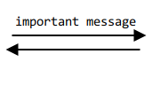

NAT traversal methods
=====================

## NAT traversal in P2PSP protocol
Information about NAT traversal in the P2PSP protocol can be found in the
[P2PSP protocol documentation][1] and in [this slideshow][2].
This document documents the NAT traversal methods developed in the GSoC 2015
project "NAT traversal using UDP hole punching".

## NAT types
The behaviour of different implementations of NAT devices (i.e. routers), can be
grouped into a few different NAT types. A short description from [this page][3]:

* **Full-cone NAT (FCN):**
"A full-cone NAT is one where all requests from the same internal IP address
and port are mapped to the same external IP address and port. Any external
host can send a packet to the internal host simply by sending a packet to the
mapped external address."

* **Restricted cone NAT (RCN):**
"A restricted-cone NAT is one where all requests from the same internal IP
address and port are mapped to the same external IP address and port. Unlike a
full-cone NAT though, an external host can send a packet to the internal host
only if the internal host had previously sent a packet to that external host."

* **Port-restricted cone NAT (PRCN):**
"A port-restricted cone NAT is like a restricted-cone NAT, but the restriction
also includes port numbers. An external host can send a packet to the internal
host only if the internal host had previously sent a packet to that external
host on the same port number."

* **Symmetric NAT (SYM):**
"A symmetric nat is a NAT where all requests from the same internal IP address
and port to a specific destination IP address and port are mapped to the same
external source IP address and port. If the same internal host sends a packet
with the same source address and port to a different destination, a different
mapping is used (these mappings are referred to as NAT translations). Only the
external host that receives a packet can send a packet back to the internal
host."

As described in [this paper][4], the symmetric NATs can be divided again into
these subtypes, depending on the allocation of the source port of the NAT:

* **Port preservation (SYMPP):**
The public source port of the NAT is the same as the source port of the local
host. If this NAT behaviour is detected, prediction of the public port is
trivial.

* **Sequential port allocation (SYMSP):**
To allocate a new public source port, the next free port number is selected, so
the port number is incremented each time. This behaviour is covered by the P2PSP
NTS of rules in algorithms 5 and 6.

* **Random port allocation (SYMRP):**
For each new pair `(dest. address, dest. port)` a completely random public
source port is selected. A connection between two peers each behind this NAT
type cannot be established, as each other's public source port is unpredictable.

## NAT type determination
To be able to traverse a NAT device, the type of the NAT has to be determined
correctly. For this, the NAT types are grouped into port preserving NAT devices
(FCN, RCN, PRCN, SYMPP), and types with destination dependent port allocation
(SYMSP, SYMRP). The port preserving types are not differentiated, as the
NAT traversal overhead unnecessary for FCN devices is less effort than detecting
the FCN type, and NAT traversal of RCN, PRCN, SYMPP can be handled equally.
The randomly source port allocating type is not handled differently than the
sequentially allocating type, as the allocated ports cannot be predicted and the
unnecessary port prediction overhead negligible.

To determine the port allocation method of a new peer A, it sends UDP packets to
the splitter and to the monitor peer(s), and the monitor peers forward the
source ports used at the new peer to the splitter.

Between two packets sent by the P2PSP software, another software behind the same
NAT could also send UDP packets to a new destination and the measured port
distance would be higher than the actual port step of the NATs. Therefore the
splitter calculates the distance between each source port used by the new peer
and combines them using the greatest common divisor (GCD), to determine the port
step of the NAT. Also, when a new peer B arrives and connects to the now
incorporated peer A, both peers send the source port used by each other to the
splitter. The splitter then calculates the distance between the source port
towards itself and towards the other peer and combines the distance and the
previously determined port step using GCD, for each of the peers.

So the more monitor peers there are in the team, the more accurately determined
is the port step of a new peer before incorporating it into the team, and the
more peers there are in the team, the more accurately determined is the port
step of already incorporated peers.

If the determined port step is 0, the NAT is one of the FCN, RCN, PRCN, SYMPP
types and NAT traversal is trivial. Otherwise the P2PSP software will try to
predict the source ports chosen next by the NAT. See details below.

## Message sending
The P2PSP software uses TCP during initialization and incorporation of a new
peer in a team. Afterwards UDP is used due to its low latency needed for live
video broadcasting. As UDP is per design an unreliable protocol and packets may
drop or arrive several times in any order, important data (needed for
establishing connections between peers) is sent continuously in regular
intervals. The receiver then sends exactly the same message as an acknowledge
back to the sender, once for each received message.
In the following diagrams, this is symbolized by a second arrow in the opposing
direction below:

[1]: http://p2psp.org/en/p2psp-protocol?cap=indexsu9.html
[2]: http://slides.p2psp.org/BCN-2015
[3]: https://wiki.asterisk.org/wiki/display/TOP/NAT+Traversal+Testing
[4]: https://tools.ietf.org/id/draft-takeda-symmetric-nat-traversal-00.txt
