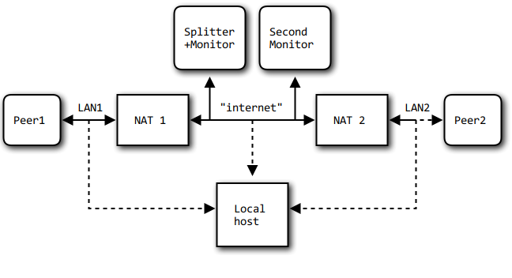

NAT traversal testing
=====================

## NAT traversal in P2PSP
Basic information about NAT traversal techniques in P2PSP can be found in the
[official documentation](http://p2psp.org/en/p2psp-protocol?cap=indexsu9.xht)
and in [this slideshow](http://slides.p2psp.org/BCN-2015).

## Test setup
To test the connection between two peers behind NATs, the whole setup can be
simulated in virtual machines. You need one machine for each peer, the splitter,
and the NATs (routers). The monitor (i.e. the first peer) is running on the same
host as the splitter.

The setup is shown in the following diagram:

The different NAT types (Full Cone NAT, Restricted Cone NAT, Port-Restricted
Cone NAT, Symmetric NAT) can be emulated by linux hosts, that are configured
with iptables and packet forwarding enabled (`sysctl net.ipv4.ip_forward=1`).
The iptables rules used in the NATs can be found
[here](https://wiki.asterisk.org/wiki/display/TOP/NAT+Traversal+Testing).

## Test setup details
Details on the simulated test network and more information about NAT types can
be found [here](NAT_test_details.md).

## Running the test
To run the test on your setup, you have to setup ssh so no password input is
needed (e.g. with public key authentification), setup the iptables rules in
`/etc/iptables/iptables.rules.{fcn,rcn,prcn,sym}` and adapt the configuration in
`tools/test_NAT_traversal.sh` to your needs and run the script.

Note that a video to stream is necessary; the filename can be specified in the
variable `source_filename` in the header of the script.

The testing script automatically starts splitter, monitor, two peers and players
and quits them after a while, and checks the output if each of the 3 peers
have received packets from the other two. This is done for all combinations of
NAT types and printed in a table. The test needs about 5 minutes.
