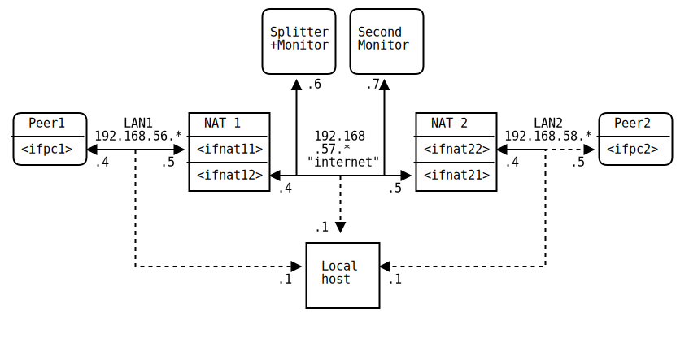

NAT traversal testing
=====================

This document shows detailed information about the test network setup
used to test NAT traversal between two P2PSP peers, each behind a
NAT. General information about the test can be found
[here](NAT_traversal_testing.md).

## Network setup

The setup with network interfaces and IP addresses as used in the
tests is shown in the following diagram:

On a Linux machine with network namespaces, the network can be
automatically set up by running
[this script](../tools/setup_NAT_network.sh) as root.  The network can
also be set up using virtual machines for each host in the diagram.

## NAT types

To test the behaviour of peers behind different kinds of NAT devices
(i.e.  routers), different NAT types are simulated. The
characteristics of each type is described in
[this document](NAT_traversal.md). The different NAT types are
configured by the iptables in [this directory](iptables/).

### SYMSP workaround

If iptables is configured like [this](iptables/iptables.rules.symsp1),
then UDP packets **by different sockets to the same destination** will
each have an incremented source port, else the mapping would be
ambiguous. Now if any number of sockets connect to different
destinations, for each it uses the same source port, because the
mapping is not ambiguous. A sequentially port allocating symmetric NAT
(SYMSP) however increments the source port in the latter case.

To achive the desired behaviour, the
[`symsp_socket`](../src/core/symsp_socket.py) and
[`symsp_peer`](../src/core/symsp_peer.py) classes force the NAT to
allocate a new port by the following workaround:

* The peer connects to destination A; source port P is allocated.

* The peer now wants to connect to the new destination B; the
  `symsp_socket` class creates a new temporary socket and connects
  this to B. Because of a new socket to a new destination, source port
  P is allocated again, as there is no ambiguity with other mappings.

* Now the `symsp_socket` class connects the original socket to B, and
  because port P is already used by another socket, source port P+1 is
  allocated.

This is done for each new destination, so for destination C the
`symsp_socket` class would force the NAT to allocate source port
P+2. To simulate higher port steps, more temporary sockets are created
and connected to the new destination, before being closed right after.

### SYMPP oddities

The SYMPP NAT (as specified by the iptables rules) sends an ICMP
Destination Unreachable packet if there is no NAT entry assigned to
this port. Apparently the PRCN and SYMPP NATs immediately close the
NAT entry if such an ICMP packet is received, and somehow remember the
(address, port) tuple as "not responding", so that further connection
attempts will fail. This has the following two consequences:

* In the SYMPP<->SYMPP scenario (two peers behind a SYMPP NAT try to
  connect to each other), the connection only works if the two peers
  send the first packet to each other "simultaneously".

* In the SYMPP<->PRCN scenario, the connection works if the two peers
  send the first packet to each other "simultaneously", or if the peer
  behind the SYMPP NAT sends its first packet before the other peer.

Supposed that peer 1 sends its first packet to peer 2,
"simultaneously" here means that the NAT entry at peer 2 has to be
created before the packet from peer 1 arrives, or the packet from peer
2 has to arrive at peer 1 before the ICMP packet, in order to mark the
NAT entry at peer 1 as assured.

The time difference between the first packets from each peer is
determined by the packet jitter (delay variation) of the splitter plus
the difference in delay between the two peers. This time difference
has to be less than the sum of both peers' delay, in order to
successfully connect. Apparently this applies in nearly all cases,
just not in the network simulation where the jitter (~5ms) is higher
than the delay (~3ms).

Via the [tc command and the netem module][1], additional delay and
jitter can be configured for the network interfaces. With a delay at
the peers of 4ms and above, the connection can be reliably
established.

### Realistic network scenarios

To test realistic network scenarios, a delay and jitter (as noted
above) and an average rate of packet loss is configured for each
network interface. As the test script runs each configuration several
times, it can be estimated how reliably a connection can be
established between different NAT types under different network
conditions.

[1]: http://www.linuxfoundation.org/collaborate/workgroups/networking/netem
