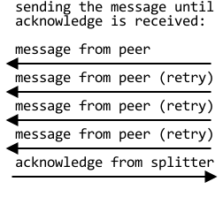
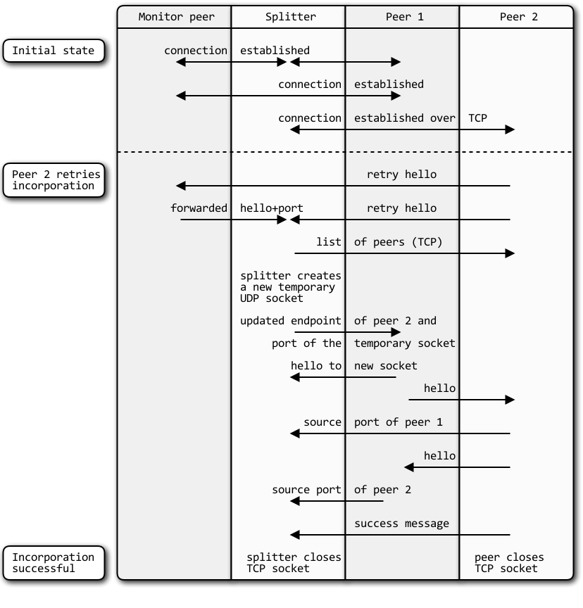

NAT traversal techniques
========================

## NAT traversal in P2PSP protocol

Information about NAT traversal in the P2PSP protocol can be found in
the [P2PSP protocol documentation][1] and in [this slideshow][2].
This document documents the NAT traversal methods developed in the
GSoC 2015 project "NAT traversal using UDP hole punching" as a python
implementation in the NAT Traversal Set of rules (NTS) classes.

## NAT types

The behaviour of different implementations of NAT devices
(i.e. routers), can be grouped into a few different NAT types. A short
description from [this page][3]:

* **Full-cone NAT (FCN):**

"A full-cone NAT is one where all requests from the same internal IP
address and port are mapped to the same external IP address and
port. Any external host can send a packet to the internal host simply
by sending a packet to the mapped external address."

* **Restricted cone NAT (RCN):**

"A restricted-cone NAT is one where all requests from the same
internal IP address and port are mapped to the same external IP
address and port. Unlike a full-cone NAT though, an external host can
send a packet to the internal host only if the internal host had
previously sent a packet to that external host."

* **Port-restricted cone NAT (PRCN):**

"A port-restricted cone NAT is like a restricted-cone NAT, but the
restriction also includes port numbers. An external host can send a
packet to the internal host only if the internal host had previously
sent a packet to that external host on the same port number."

* **Symmetric NAT (SYM):**

"A symmetric nat is a NAT where all requests from the same internal IP
address and port to a specific destination IP address and port are
mapped to the same external source IP address and port. If the same
internal host sends a packet with the same source address and port to
a different destination, a different mapping is used (these mappings
are referred to as NAT translations). Only the external host that
receives a packet can send a packet back to the internal host."

As described in [this paper][4], the symmetric NATs can be divided
again into these three subtypes, depending on the allocation of the
source port of the NAT:

* **Port preservation (SYMPP):**

The public source port of the NAT is the same as the source port of
the local host. If this NAT behaviour is detected, prediction of the
public port is trivial.

* **Sequential port allocation (SYMSP):**

To allocate a new public source port, the next free port number is
selected, so the port number is incremented each time. This is
described in detail below.

* **Random port allocation (SYMRP):**

For each new pair `(dest. address, dest. port)` a completely random
and therefore unpredictable public source port is selected.

### NAT type determination

To be able to traverse a NAT device, the type of the NAT has to be
determined correctly. For this, the NAT types are grouped into port
preserving NAT devices (FCN, RCN, PRCN, SYMPP), and types with
destination dependent port allocation (SYMSP, SYMRP). The port
preserving types are not differentiated, as the NAT traversal overhead
unnecessary for FCN devices is less effort than detecting the FCN
type, and NAT traversal of RCN, PRCN, SYMPP can be handled equally.
The randomly source port allocating type is not handled differently
than the sequentially allocating type, as the allocated ports cannot
be predicted and the unnecessary port prediction overhead negligible.

To determine the port allocation method of a new peer A, it sends UDP
packets to the splitter and to the monitor peer(s), and the monitor
peers forward the source ports used at the new peer to the splitter.

Between two packets sent by the P2PSP software, another software
behind the same NAT could also send UDP packets to a new destination
and the measured port distance would be higher than the actual port
step of the NATs. Therefore the splitter calculates the distance
between each source port used by the new peer and combines them using
the greatest common divisor (GCD), to determine the port step of the
NAT. Also, when a new peer B arrives and connects to the now
incorporated peer A, both peers send the source port used by each
other to the splitter. The splitter then calculates the distance
between the source port towards itself and towards the other peer and
combines the distance and the previously determined port step using
GCD, for each of the peers.

So the more monitor peers there are in the team, the more accurately
determined is the port step of a new peer before incorporating it into
the team, and the more peers there are in the team, the more
accurately determined is the port step of already incorporated peers.

If the determined port step is 0, the NAT is one of the FCN, RCN,
PRCN, SYMPP types and NAT traversal is trivial. Otherwise the P2PSP
software will try to predict the source ports chosen next by the
NAT. See details below.

## UDP hole punching and port prediction

### UDP hole punching

NAT devices (all but the FCN type) only forward packets from a peer to
the local network if previously a packet to the peer address and port
has been sent and therefore a NAT entry exists (for RCN, a packet must
have been sent to the peer address and **any** port). Therefore hello
packets are sent continuously between two peers until both peers have
received a packet from each other.

### Source port prediction

In case peer A and B want to connect to each other and peer A is
behind a NAT with a different source port for each destination, normal
UDP hole punching does not work:

* Peer A sends a packet to peer B, with a randomly generated source
  port; a NAT entry at peer A is created.

* The packet does not reach peer B, because there is no corresponding
  NAT entry at the NAT of peer B.

* Peer B sends a packet to peer A, with the same source port as for
  every destination; a NAT entry at peer B is created.

* The packet does not reach peer A, because the destination port at
  peer A that peer B sent to does not match the source port of the
  packet to peer B.

If peer A can predict the source port that will be allocated for the
packet from peer B, then peer A can send packets to this port and they
will be forwarded by the NAT as a matching NAT entry exists.

#### Simple port prediction

When a new peer behind a sequentially allocating NAT wants to be
incorporated into the team, it sends hello packets to the splitter and
to the monitors, and then to all peers, one after another. For each
new destination, the allocated source port is increased by the port
step of the NAT. So for a given `port_step` and a `peer_number`, the
predicted source port is:

    ```
    predicted_source_port = source_port_to_splitter + peer_number * port_step
    ```

#### Advanced port prediction

When during the sending of the hello packets to the peers another
packet is sent by any host behind the same NAT, a source port will be
allocated for that packet as well. So one port number is skipped and
the following outgoint packets will have a source port
`predicted_source_port + port_step`. To increase the probability that
the correct source port is matched, the peers try various numbers of
skips out of `{0,1,...}`, and for each the predicted source port is:

    ```
    predicted_source_port =
        source_port_to_splitter + (peer_number + skips) * port_step
    ```

#### Even more advanced port prediction

There are a few more things to consider when predicting source
ports. In the following paragraph it is assumed that the splitter has
determined a port distance of 10 and the third peer tries to predict
the source port of the newly arriving peer and tries 20 different
ports to have good chances:

1. The port step cannot be determined reliably (as stated above). If
   the splitter measures a port distance of 10, it could actually be
   one of {1,2,5,10}. So there is a measured port distance and an
   actual port step.

2. For each probable port step, different numbers of "skips" should be
   tried, because some source ports are skipped if the port is already
   taken by another UDP "connection". So as the third peer is 3 port
   steps after the monitor, the ports {3,4,...}, {6,8,...},
   {15,20,...}, {30,40,...} should be tried (in addition to
   `source_port_to_splitter`).

3. The number of port "skips" depends on the assumed port step: If a
   port step of 10 is measured but a port step of 1 is assumed, then
   there must have been 9 port skips between the UDP packets to the
   splitter and to the monitor. So it is very likely that there will
   be also many port skips between the packets to the peers, so
   different numbers of skips should be tried: {3,4,5,6,7,8}.  On the
   other hand, if both the measured and the assumed port step are 10,
   then there have been no port skips and it is less likely that some
   will occur between the packets to the peers, so few port skips are
   tried: {30,40}.

Two examples where a trivial implementation (assuming either a port
step of 1 or assuming the measured port distance as the port step)
would fail:

* When a port step of 1 is assumed for all NATs, and the actual port
  step is 10, then the predicted ports will be {3,4,...,23}, while the
  actual taken port is one of {30,40,...}, depending on the number of
  skips.

* If the assumed port step is 10 and the actual is 1, then the
  predicted ports will be {30,40,...,230}, while the actual taken port
  is one of {3,4,...}.

To solve this, an algorithm was developed that assumes different port
steps and for each assumes different numbers of skips, and calculates
probable `port_diffs` (in addition to `source_port_to_splitter`) given
any determined port distance `port_diff` and `peer_number` (the
position in the team of the peer that does the port prediction).

    ```
    # Get probable port steps
    factors = self.get_factors(port_diff)
    # Estimate how many port guesses will be made
    num_combinations = self.count_combinations(factors)
    # Influence the prediction to achieve the desired number of results
    count_factor = common.MAX_PREDICTED_PORTS/float(num_combinations)

    port_diffs = sorted(set(functools.reduce(list.__add__, (list(
        # For each previous peer and each skip, the source port is incremented
        port_step * (peer_number + skips)
        # For each assumed port_step, "port_diff/port_step" different port skips
        # are tried, multiplied with count_factor to get the desired list length
        for skips in range(int(math.ceil(port_diff/port_step*count_factor))+1))
        # Each factor of port_diff is a possible port_step
        for port_step in factors))))
    ```

The desired number of results can be approximately achieved. For the
example above, the algorithm yields:

    ```
    port_diffs = [3, 4, 5, 6, 7, 8, 9, 10, 11, 12, 13, 14, 15, 16, 18, 20, 25,
        30, 40, 50]
    ```

### Limits for UDP hole punching and port prediction

In some scenarios UDP hole punching with port prediction cannot work
by design.  When one peer is behind a port-restricted NAT (PRCN, or a
symmetric NAT), it only receives messages if they come from an
address/port tuple that the peer previously sent a message to. If the
other peer is behind a NAT with an randomly (not sequentially)
allocated source port, then the first peer cannot predict the source
port of a message from the second peer and send a message to this
endpoint. So a peer with port-restricted NAT and a peer with a
randomly source port allocating NAT cannot send messages to each
other.

To determine the possible combinations, the NAT types can be divided
into three classes:

1. Not port-restricted, with a predictable port number (FCN, RCN)

2. Port-restricted, with a predictable port number (PRCN, SYMPP,
   SYMSP)

3. Port-restricted, with an unpredictable port number (SYMRP)

This assumes that all symmetric NAT implementations are
port-restricted. For these three classes, the following combinations
theoretically can work:

    ```
    Peer1\2 | 1.  | 2.  | 3.
    =========================
    1.      | yes | yes | yes
    2.      | yes | yes | no
    3.      | yes | no  | no
    ```

Using the six different NAT types, the table looks like this:

    ```
    Peer1\2 | fcn   | rcn   | prcn  | sympp | symsp | symrp
    =========================================================
    fcn     | yes   | yes   | yes   | yes   | yes   | yes
    rcn     | yes   | yes   | yes   | yes   | yes   | yes
    prcn    | yes   | yes   | yes   | yes   | yes   | no
    sympp   | yes   | yes   | yes   | yes   | yes   | no
    symsp   | yes   | yes   | yes   | yes   | yes   | no
    symrp   | yes   | yes   | no    | no    | no    | no
    ```

This shows that most combinations are possible, especially as
according to [this paper][5] only few NAT devices are symmetric
ones. However this also means that if there is already a peer behind a
port-restricted NAT in the team, a peer with a randomly port
allocating NAT cannot join the team at all (or vice versa).

## Implementation of the NAT Traversal Set of rules

### Reliable message sending over UDP

The P2PSP software uses TCP during initialization and incorporation of
a new peer in a team. Afterwards UDP is used due to its low latency
needed for live video broadcasting. As UDP is per design an unreliable
protocol and packets may drop or arrive several times in any order,
important data (needed for establishing connections between peers) is
sent continuously in regular intervals. The receiver then sends
exactly the same message as an acknowledge back to the sender:



The splitter has the most important role in P2PSP streaming. To reduce
load on the splitter, it does not automatically resend messages
continuously in a thread but only replies to peers if a message is
received. To ensure that a message reaches the peer, it is sent
several (currently 3) times at once:


The NAT traversal classes are developed in such a way that repeatedly
arriving messages do not affect the communication between peers.

### SYMSP source port update

The splitter saves the last known source port of all peers. When a new
peer arrives a long time after the last peer has arrived, then this
information may be out of date, if another UDP packet has been sent
from any host behind the same SYMSP NAT. To retrieve the currently
allocated source port of such a peer, during incorporation of a new
peer all already incorporated peers with a `port_step > 0` send a
hello message to a new temporary UDP socket at the splitter, for which
a new source port at the peers is allocated. So if the arriving peer
fails to connect to one of the peers, when retrying incorporation it
can rely on an up to date source port.


### NAT traversal method

The sequence of messages when a new peer is arriving and another peer
has already been incorporated into the team is shown in the diagram
below:


* Peer 1 already has been incorporated into the team and communicates
  with the splitter and monitor over UDP.

* A new peer 2 connects to the splitter over TCP and receives the
  configuration as well as the public endpoints of the peers in the
  team, including the determined port step of the NAT of each peer.

* Peer 2 continuously sends hello messages to the splitter and the
  monitor, each until an acknowledge is received.

* The monitor forwards the hello message to the splitter, appending
  the source port of peer 2 towards the monitor.

* The splitter determines the port step of peer 2 using the hello
  messages.

* The splitter binds a new socket to a random port and sends address,
  port and determined port step of peer 2 and the port of the new
  socket to peer 1.

* Peer 1 sends a hello message to the new splitter socket to determine
  its currently allocated source port for later peer arrivals.

* Peer 1 and 2 start sending hello messages to each other, each for a
  number of predicted possible ports, until an acknowledge is
  received.

* When receiving a hello message, the peers send the used source port
  of the other peer to the splitter to determine the port step more
  accurately and to save the currently allocated source port.

* After having received a hello message from peer 1, peer 2 sends a
  message of success to the splitter.

* The splitter and peer 2 close their TCP socket.

The same principle applies if there is more than monitor or more than
one already incorporated peer.


### Retrying incorporation

When a peer fails to receive hello messages from one or more
incorporated peers, it retries to join the team with a new UDP socket:



* Peer 1 already has been incorporated into the team and communicates
  with the splitter and monitor over UDP.

* Peer 2 closes its UDP socket and creates a new one, to have
  different source ports.

* Peer 2 sends a retry message to the splitter and the monitor, each
  until an acknowledge is received.

* The splitter sends the public endpoints of the peers in the team,
  including the determined port step of the NAT of each peer. This is
  necessary as the peer list or port information could have changed
  since peer 2 tried to get incorporated.

* The monitor forwards the retry message to the splitter, appending
  the source port of peer 2 towards the monitor.

* The splitter determines the port step of peer 2 using the retry
  messages.

* The splitter binds a new socket to a random port and sends address,
  port and determined port step of peer 2 and the port of the new
  socket to peer 1.

* Peer 1 sends a hello message to the new splitter socket to determine
  its currently allocated source port for later peer arrivals.

* Peer 1 and 2 start sending hello messages to each other, each for a
  number of predicted possible ports, until an acknowledge is
  received.

* When receiving a hello message, the peers send the used source port
  of the other peer to the splitter to determine the port step more
  accurately and to save the currently allocated source port.

* After having received a hello message from peer 1, peer 2 sends a
  message of success to the splitter.

* The splitter and peer 2 close their TCP socket.

As above, the same principle applies if there is more than monitor or
more than one already incorporated peer.

After the splitter has received a message of success, a peer cannot
retry incorporation anymore. This is to ensure that an attacker cannot
disturb the communication of a peer once it is incorporated into the
team.

[1]: http://p2psp.org/en/p2psp-protocol?cap=indexsu9.html
[2]: http://slides.p2psp.org/BCN-2015
[3]: https://wiki.asterisk.org/wiki/display/TOP/NAT+Traversal+Testing
[4]: https://tools.ietf.org/id/draft-takeda-symmetric-nat-traversal-00.txt
[5]: http://samy.pl/pwnat/pwnat.pdf
