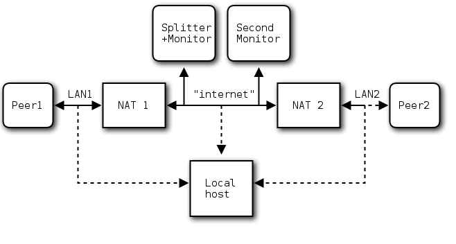

NAT traversal testing
=====================

## Test network setup

To test the connection between two peers behind NATs, the whole
network can be simulated in virtual machines or network
namespaces. You need one machine for each peer, the splitter, and the
NATs (routers). The monitor peer is run on the same host as the
splitter. The setup is shown in the following diagram:

Details about how the test network can be set up using network
namespaces or virtual machines can be found
[here](NAT_test_details.md), and more information about NAT types and
developed NAT traversal methods [here](NAT_traversal.md).

## Running the test yourself

To easily setup the hosts in a simulated network as above on a Linux
machine, you can just run [this script](../tools/setup_NAT_network.sh)
as root.

You can use this [script](../tools/test_NAT_traversal.sh) for
automatic tests.  To run the test on your machine, you have to setup
ssh so no password input is needed (e.g. with public key
authentification), place the `iptables.rules` files in
`/etc/iptables/` and adapt the configuration in
`tools/test_NAT_traversal.sh` to your needs and run the script.

Note that a video to stream is necessary; the filename can be
specified in the variable `source_filename` in the header of the
script.

The testing script automatically starts splitter, monitor, two peers
and players and quits them after a while, and checks if the two peers
have received packets from the other by checking the NAT entries. This
is done several times for all combinations of NAT types, and the
percentage of successful test runs is printed in a table. The test
needs several minutes to complete, depending on the number of test
runs.

To run just one team and get filtered and colorized output messages,
you can adapt [this script](../tools/testrun.sh) and source it in the
shell. It will automatically increment ports for each run and setup a
team with splitter, two monitors and two peers on the specified hosts.
